# CausalFunnel Analytics Platform


A production-grade, miniature behavioral analytics platform capable of capturing, ingesting, and visualizing user telemetry. Built as a scalable monorepo, this system strictly decouples the client tracking SDK from the backend ingestion API and analytics dashboard, mirroring the architecture of enterprise products like Mixpanel, Hotjar, and CausalFunnel.

### Feature Highlights
- **Page-Agnostic SDK:** Embeds securely into any HTML page. Captures clicks, scrolls, and rage-clicks without framework lock-in.
- **Reliable Ingestion Pipeline:** High-throughput batch API with memory-bounded validation, Zod type safety, and background aggregation.
- **Coordinate Normalization:** Heatmaps automatically adjust across responsive breakpoints using computed `(xPct, yPct)` vectors.
- **Frustration Intelligence:** Algorithmic detection of "Dead Clicks" and "Rage Clicks" mapped to exact DOM node selectors.
- **Live Event Telemetry:** Server-Sent Events (SSE) streaming real-time interactions to the dashboard with zero polling.

<div align="center">
  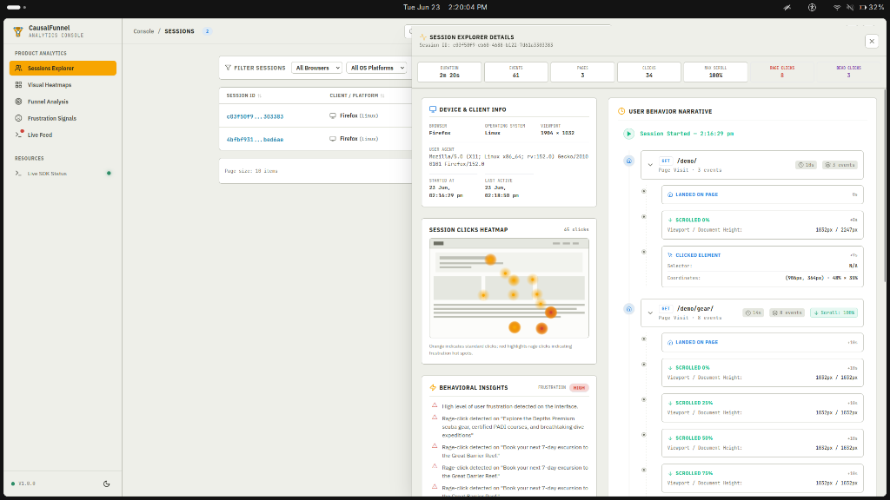
</div>

### Hosted Links
* **Dashboard URL:** [https://user-analytics-causalfunnel.vercel.app](https://user-analytics-causalfunnel.vercel.app)
* **Backend API URL:** [https://user-analytics-application-pna6.onrender.com](https://user-analytics-application-pna6.onrender.com)
* **Demo Store URL:** [https://user-analytics-application-pna6.onrender.com/demo](https://user-analytics-application-pna6.onrender.com/demo)
* **Repository URL:** [https://github.com/urvagandhi/User-Analytics-Application](https://github.com/urvagandhi/User-Analytics-Application)

---

## Architecture Overview

The system strictly enforces separation of concerns. The customer website and dashboard share zero code, communicating exclusively through the unified telemetry payload.

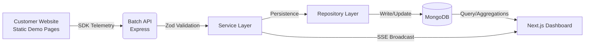

---

## Features

### Core Analytics
| Feature | Description |
|---|---|
| **Rolling Sessions** | 30-minute inactivity timeouts managed via `localStorage` IDs. |
| **Page Views** | Automatically intercepts hard navigations and native `window.location`. |
| **Event Batching** | Configurable interval batching to reduce network round-trips. |

### Advanced Analytics
| Feature | Description |
|---|---|
| **Visual Heatmaps** | Density maps calculated via responsive percentages instead of absolute pixels. |
| **Scroll Milestones** | Passive tracking at `0%, 25%, 50%, 75%, 100%` scroll depth. |
| **Frustration Signals** | Algorithmic detection of Rage Clicks (fast succession) and Dead Clicks (non-interactive DOM). |
| **Funnel Analysis** | Sequence-based validation computing drop-off rates across sequential `urlPath` stages. |

### Real-Time Features
| Feature | Description |
|---|---|
| **Live Telemetry Feed** | SSE streaming delivering events to the dashboard in milliseconds. |
| **Beacon Fallback** | Utilizes `navigator.sendBeacon()` upon `visibilitychange` for tab-close survival. |

### Developer Experience
| Feature | Description |
|---|---|
| **Zod Type Safety** | Shared package guaranteeing identical types across Tracker, Backend, and Frontend. |
| **Turborepo** | Fast, cached, incremental monorepo builds via `pnpm workspaces`. |

---

## System Architecture

### Event Pipeline
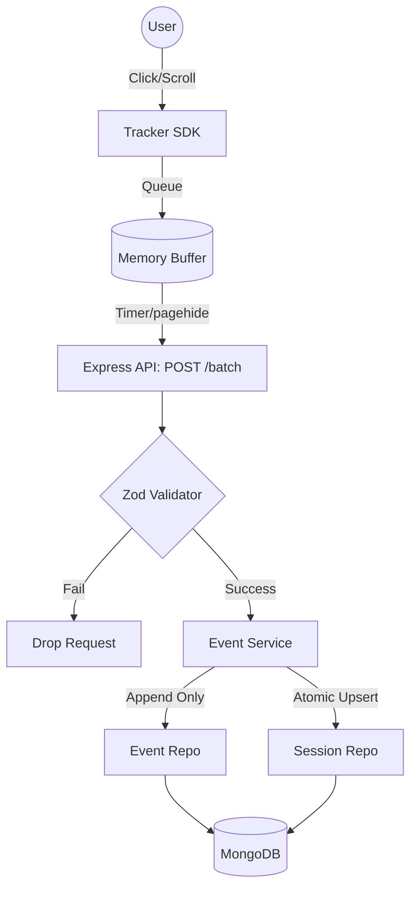

### Session Lifecycle
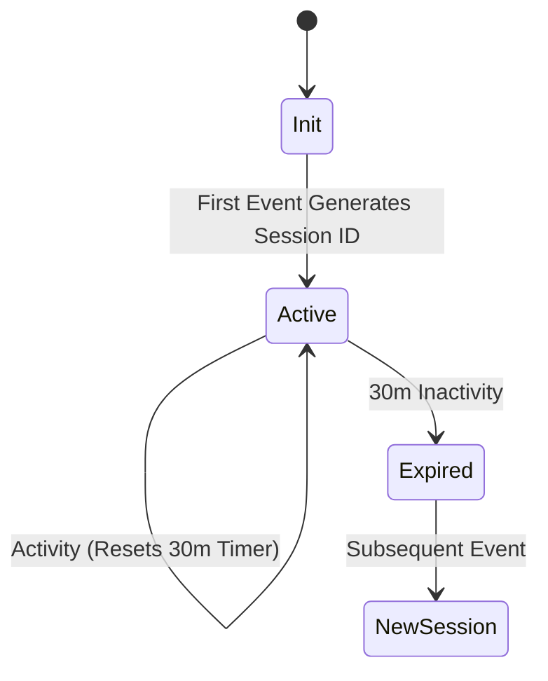

### Monorepo Structure
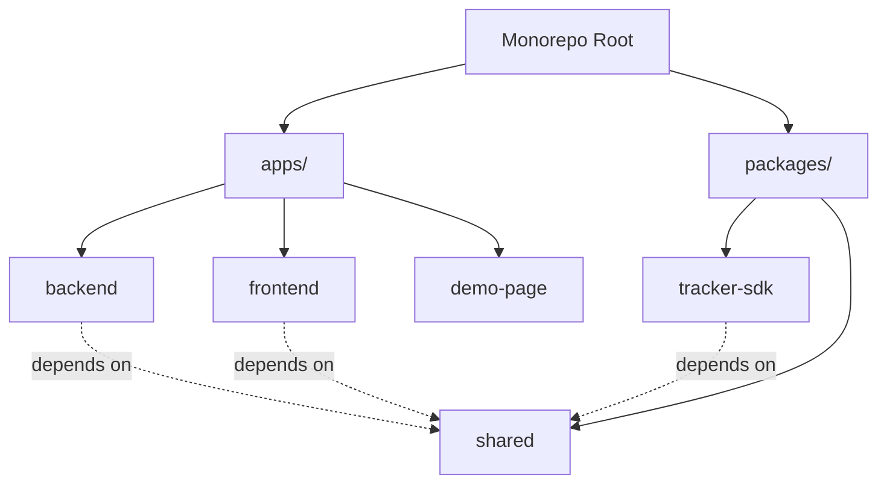

### Live Feed (SSE)
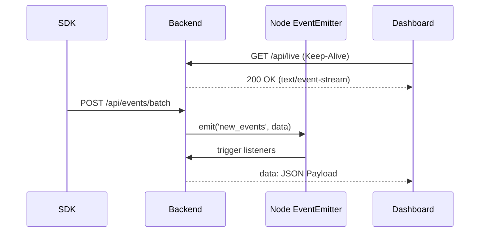

### Funnel Analysis Flow
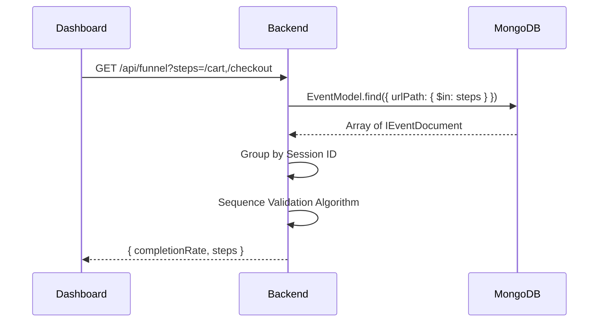

### Session Query Flow
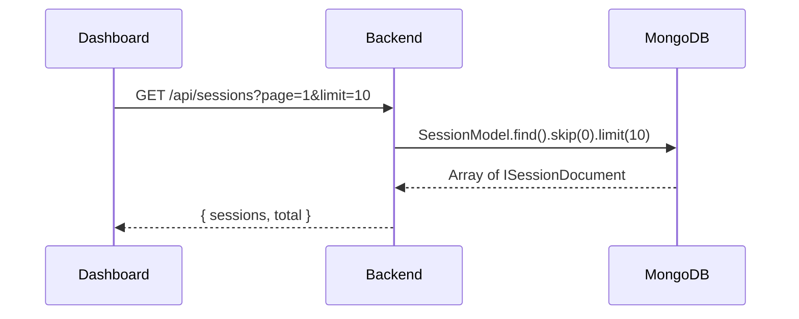

### Heatmap Flow
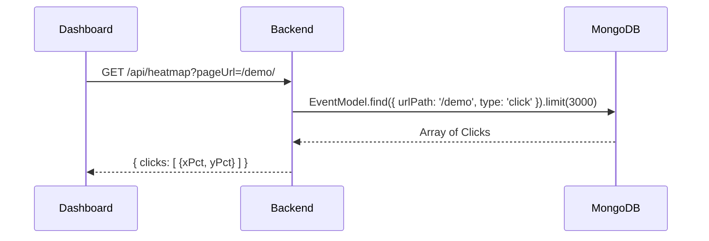

---

## Tech Stack

| Layer | Technology | Purpose | Reason |
|---|---|---|---|
| **Backend** | Express.js | API & SSE | Minimal overhead, native stream handling for live telemetry. |
| **Frontend** | Next.js | Dashboard UI | Server components for fast initial load. |
| **Language** | TypeScript | Type Safety | Eliminates runtime regressions across micro-packages. |
| **Database** | MongoDB | Document Store | High-throughput, schema-less writes for polymorphic events. |
| **Data Access** | Mongoose | ODM | Built-in connection pooling and aggregation pipeline builders. |
| **State Sync** | TanStack Query | Client State | Background polling, caching, and loading state management. |
| **UI State** | Zustand | Global State | Unopinionated, zero-boilerplate alternative to Redux. |
| **Styling** | Tailwind CSS | CSS Utility | Rapid prototyping and uniform design system. |
| **Validation**| Zod | Schema Engine | Used in `@shared` to validate endpoints and generate TS types. |
| **Logging** | Pino | JSON Logging | Lowest-overhead structured logging for production auditing. |
| **Tooling** | pnpm workspaces | Package Manager | Fast installs, strict symlinking, and dependency isolation. |

---

## Monorepo Structure

```text
├── apps/
│   ├── backend/         # Express ingestion API, MongoDB connections, SSE Controller
│   ├── frontend/        # Next.js Analytics Console UI
│   └── demo-page/       # Agnostic static HTML site demonstrating SDK integration
├── packages/
│   ├── shared/          # Zod schemas, interfaces, enums (Single Source of Truth)
│   └── tracker-sdk/     # Vanilla TypeScript telemetry SDK
├── package.json         # Workspace definition
├── docker-compose.yml   # Local infrastructure
└── turbo.json           # Build caching rules
```

---

## Getting Started

### Prerequisites
- Node.js `v20+`
- pnpm `v9+`
- Docker & Docker Compose
- MongoDB (Local or Atlas URL)

### Environment Variables

Copy `.env.example` to `.env`.

| Variable | Description | Example | Required |
|---|---|---|---|
| `MONGO_URI` | MongoDB Connection String | `mongodb://localhost:27017/causalfunnel` | Yes |
| `PORT` | Backend API Port | `5000` | No |
| `FRONTEND_URL` | CORS Origin for backend | `http://localhost:3000` | Yes |
| `NEXT_PUBLIC_API_URL` | Backend URL for Next.js | `http://localhost:5000/api` | Yes |

### Running Locally

```bash
# 1. Install workspace dependencies
pnpm install

# 2. Build shared packages
pnpm run build --filter="@causal-funnel/shared" --filter="@causal-funnel/tracker-sdk"

# 3. Start development servers concurrently
pnpm run dev
```

---

## Docker Setup

The entire stack (Backend, Frontend, MongoDB) is containerized for seamless onboarding.

```bash
# Start all services detached
docker compose up -d

# View aggregate logs
docker compose logs -f

# Shut down and remove volumes
docker compose down -v
```
Services:
- **`mongodb`**: Port `27017`
- **`backend`**: Port `5000`
- **`frontend`**: Port `3000`

---

## Hosted Demo

- **Dashboard**: [https://user-analytics-causalfunnel.vercel.app](https://user-analytics-causalfunnel.vercel.app)
- **Backend API**: [https://user-analytics-application-pna6.onrender.com](https://user-analytics-application-pna6.onrender.com)
- **Demo Store**: [https://user-analytics-application-pna6.onrender.com/demo](https://user-analytics-application-pna6.onrender.com/demo)

---

## API Documentation

| Method | Endpoint | Description |
|---|---|---|
| **POST** | `/api/events/batch` | Ingests a validated telemetry payload. |
| **GET** | `/api/sessions` | Retrieves paginated sessions list. |
| **GET** | `/api/sessions/:id` | Retrieves chronological events for a single session. |
| **GET** | `/api/heatmap` | Retrieves normalized click coordinates for a URL. |
| **GET** | `/api/frustration` | Retrieves aggregated rage and dead clicks. |
| **GET** | `/api/live` | SSE stream of real-time incoming events. |
| **GET** | `/api/funnel` | Calculates funnel sequence completion rates. |
| **GET** | `/api/health` | Standard readiness probe. |

#### Example: `POST /api/events/batch`
**Request:**
```json
[
  {
    "type": "click",
    "sessionId": "a1b2c3d4",
    "pageUrl": "https://demo.com/cart",
    "timestamp": 1718000000000,
    "x": 450,
    "y": 800,
    "viewportWidth": 1920,
    "viewportHeight": 1080,
    "userAgent": "Mozilla/5.0..."
  }
]
```
**Response:**
```json
{
  "success": true,
  "data": { "processed": 1, "failed": 0 }
}
```

---

## Database Design

### `events` Collection (Append-Only)
| Field | Type | Description |
|---|---|---|
| `sessionId` | String | Foreign key to session. |
| `eventType` | Enum | `page_view`, `click`, `rage_click`, `scroll`, etc. |
| `urlPath` | String | Cleaned URL path (no queries/hashes) for fast `$in` lookups. |
| `xPct`, `yPct`| Number | Viewport-normalized coordinates for heatmaps. |
| `createdAt` | Date | TTL indexed for automatic expiration. |

**Indexes:**
- `{ sessionId: 1, timestamp: 1 }`
- `{ urlPath: 1, eventType: 1 }`
- `{ createdAt: 1 }` (TTL: 30 Days)

### `sessions` Collection (Materialized View)
| Field | Type | Description |
|---|---|---|
| `sessionId` | String | Unique identifier from `localStorage`. |
| `browser`, `os`| String | Parsed from User-Agent. |
| `duration` | Number | Calculated elapsed time between first and last event. |
| `eventCount` | Number | Atomic increment. |

**Indexes:**
- `{ sessionId: 1 }` (Unique)
- `{ updatedAt: -1 }` (Pagination sorting)

---

## Architecture Decision Records (ADR)

### Why a `sessions` collection exists
Querying raw events and using MongoDB `$group` pipelines to calculate session metadata (duration, counts) on-the-fly is highly CPU-intensive at scale. We use a materialized `sessions` read-model that is atomically upserted during ingestion, allowing sub-10ms queries for the dashboard.

### Why batching exists
Firing an HTTP request for every click causes mobile network congestion. The SDK holds events in memory and flushes them every 3 seconds, drastically reducing connection overhead. 

### Why raw coordinates AND percentages are stored
Raw coordinates (`x`, `y`) are meaningless if the analyst viewing the heatmap has a different monitor resolution than the user. We calculate `xPct` and `yPct` locally in the client SDK, ensuring heatmaps render accurately across all responsive breakpoints.

### Why a `@shared` types package exists
To eliminate schema drift. The Tracker SDK, Express API, and Next.js frontend all compile against the exact same Zod schemas. If a payload structure changes, the entire monorepo fails compilation instantly, guaranteeing API contract integrity.

### Why Demo Pages are static HTML
To prove the SDK is **framework-agnostic**. Building the demo inside Next.js creates artificial SPA routing behavior. Separate physical HTML pages simulate exactly how a customer would integrate the script into WordPress or Shopify, ensuring absolute decoupling from the dashboard.

### Why SSE instead of WebSockets
Telemetry data strictly flows one-way (Server → Dashboard). WebSockets require protocol upgrades, keep-alive pinging, and complicate load-balancer setups. Server-Sent Events (SSE) natively utilize standard HTTP protocols, resulting in a cleaner, more resilient live feed.

### Why Session Replay was intentionally skipped
DOM mutation observation (e.g., `rrweb`) requires significant client-side memory, aggressive privacy masking (PII stripping), and massive storage capacity. Skipping replay allows this architecture to remain lightweight and focused entirely on high-fidelity quantitative behavioral signals.

---

## Performance Considerations

- **Heatmap Limits:** The repository limits heatmap click queries to `.limit(3000)`. This bounds Node.js memory consumption and prevents out-of-memory (OOM) crashes, while providing more than enough data for visual density.
- **`urlPath` Querying:** Funnel analysis strips complex `$regex` checks. By storing the parsed `urlPath`, MongoDB natively utilizes B-Tree indexes, preventing full collection scans.
- **`sendBeacon` Fallbacks:** Batch queues automatically flush using `navigator.sendBeacon()` upon `visibilitychange: hidden`, ensuring vital exit telemetry is not canceled by the browser process termination.
- **SSE Cleanup & Timeout Avoidance:** Explicit `req.on('close')` listeners guarantee zero memory leaks on client disconnects. Additionally, `res.setTimeout(0)` and 25-second `:keepalive` heartbeats prevent reverse proxies from indiscriminately closing idle connections.

---

## Reliability Features

- **Zod Validation Pipeline:** All incoming batches are scrubbed by strict Zod parsers *before* interacting with database logic, shielding the DB from malformed payloads.
- **Bounded Storage (TTL):** An automatic 30-day Time-To-Live (TTL) index ensures the cluster disk space never fills up indefinitely.
- **Defensive SDK Error Handling:** The tracker SDK is wrapped in extensive `try/catch` blocks. It will fail silently, guaranteeing that the customer's host application never crashes due to an analytics script failure.
- **Structured Logging:** Implements `pino` for low-overhead, machine-readable JSON logs natively capturing `requestId` traces.

---

## Design Philosophy

**"The Customer Website ≠ The Analytics Dashboard"**

The overarching philosophy of this architecture is strict domain isolation. The tracked environment shares absolutely no state, memory, or context with the analytical dashboard. The telemetry payload is the single, isolated communication mechanism between the two environments. This enforces pure systems-level boundaries, ensuring the tracking SDK can be deployed anywhere without dependencies.

---

## Development Workflow

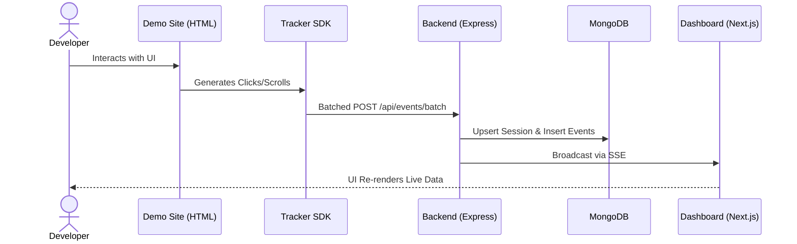

---

## Screenshots

<details>
<summary><b>Click to expand Screenshots</b></summary>

### 1. Visual Heatmaps
*(Displays localized interaction density computed via normalized percentage vectors)*
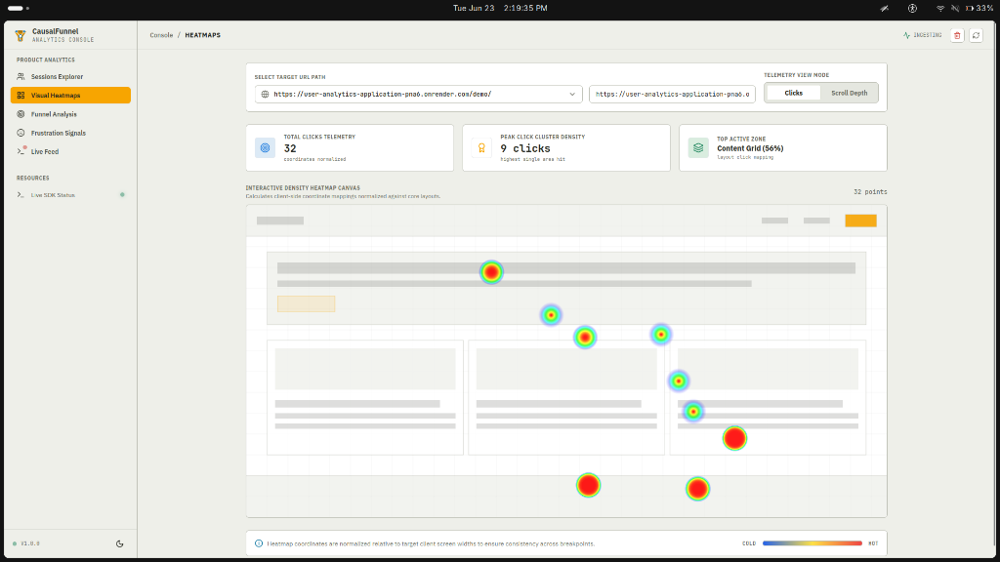

### 2. Frustration Intelligence
*(Displays specific DOM elements causing Rage & Dead Clicks)*
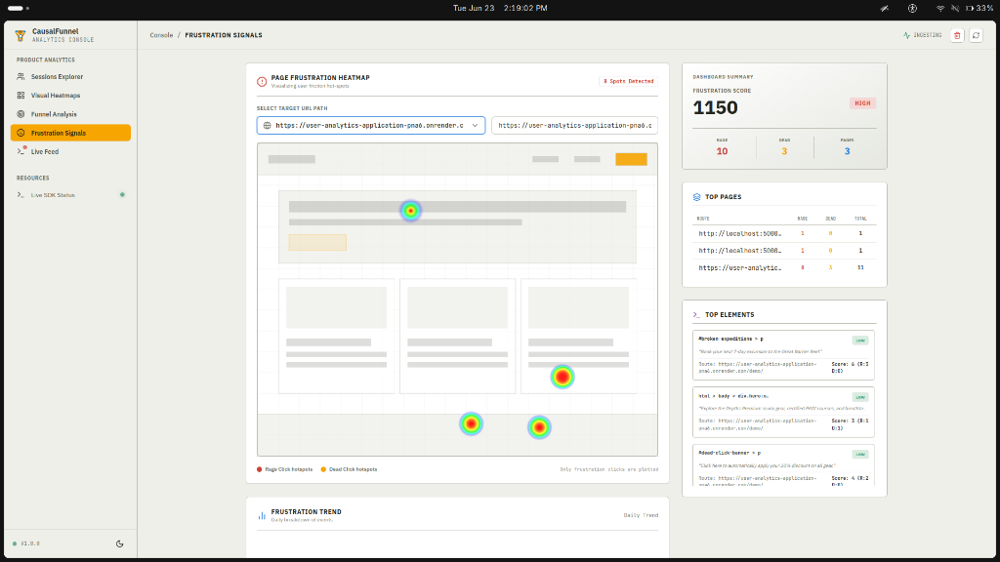

### 3. Session Explorer & Timeline
*(Displays a complete chronological user journey)*


### 4. Live Event Feed
*(Monitors real-time incoming events via SSE)*
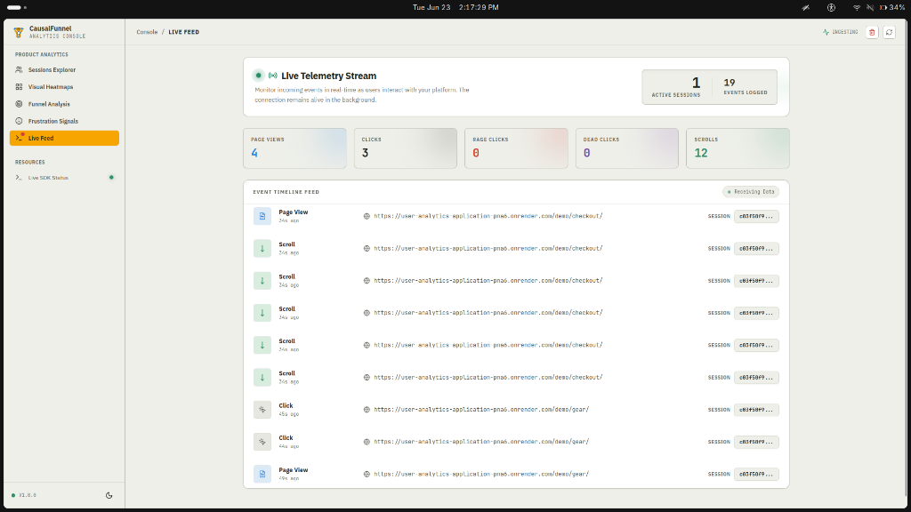

</details>

---

## Future Improvements

If the platform were to scale further, the following optimizations would be evaluated:
1. **Time-Series Collections:** Converting the `events` collection to a MongoDB Time-Series collection to radically improve storage compression and range-query latency.
2. **Device Segmentation:** Extracting screen-size thresholds inside the backend to allow filtering heatmaps by Mobile, Tablet, and Desktop viewpoints.
3. **Authentication & Multi-Tenancy:** Implementing JWT authorization to securely segment event data for multiple clients/projects.

---

## License
MIT License.

## Author
**Urva Gandhi**  
[GitHub](https://github.com/urvagandhi) | [LinkedIn](https://www.linkedin.com/in/urva-gandhi) | Architecture Assignment - CausalFunnel
