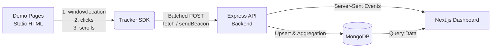
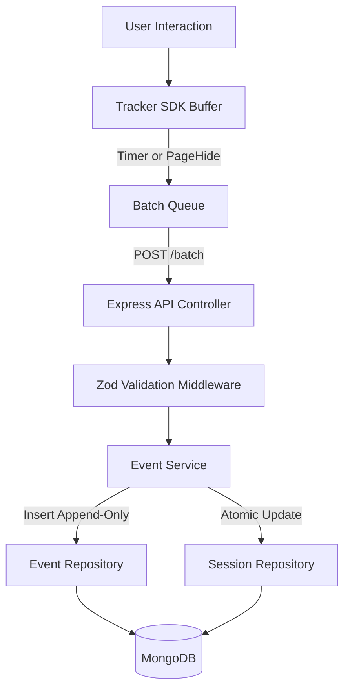
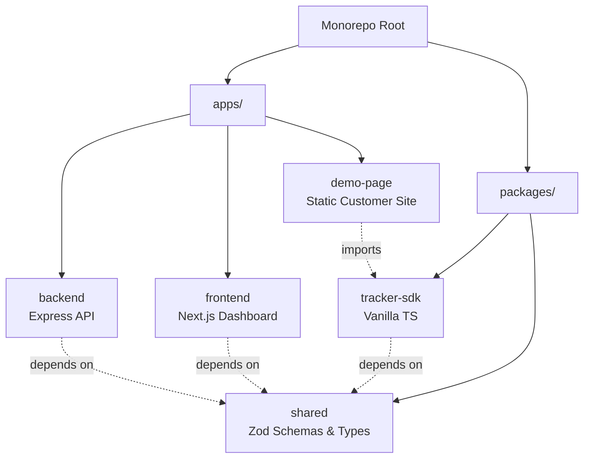
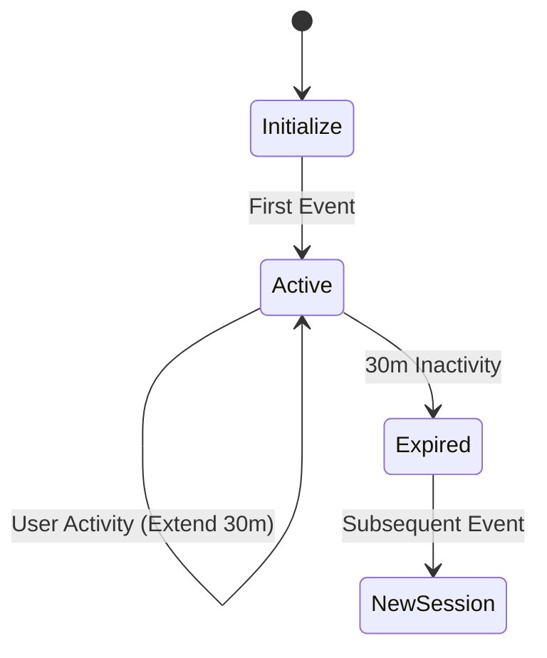
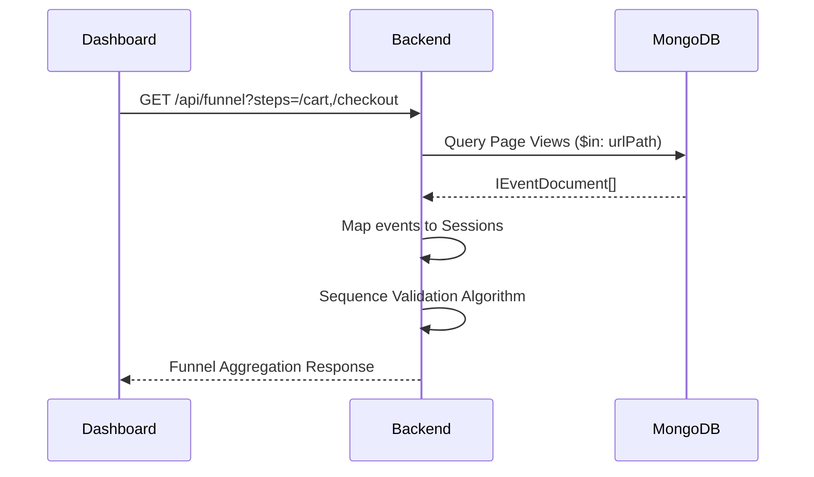

# CausalFunnel: Behavioral Analytics Platform

A production-grade, miniature behavioral analytics platform capable of capturing, ingesting, and visualizing user telemetry. Built as a scalable monorepo, this system decouples the client tracking SDK from the backend ingestion API and analytics dashboard, mirroring the architecture of enterprise products like Mixpanel, Hotjar, and CausalFunnel.

### Feature Highlights
- **Page-Agnostic SDK:** A pure TypeScript tracker that embeds anywhere and captures clicks, scrolls, and rage-clicks without framework lock-in.
- **Reliable Ingestion Pipeline:** High-throughput batch API with memory-bounded validation and background aggregation.
- **Visual Heatmaps:** Coordinate-normalized density maps that adjust dynamically across responsive breakpoints.
- **Frustration Intelligence:** Algorithmic detection of "Dead Clicks" and "Rage Clicks" mapped to exact DOM nodes.
- **Live Event Telemetry:** Server-Sent Events (SSE) streaming real-time interactions to the dashboard.

<div align="center">
  <!-- Placeholder for Hero Screenshot -->
  <i>[Hero Screenshot: Dashboard Overview showing Session Analytics]</i>
</div>

### Live Deployments
| Environment | URL |
|---|---|
| **Dashboard (Next.js)** | [https://user-analytics-casualfunnel.vercel.app](https://user-analytics-casualfunnel.vercel.app) |
| **Backend API (Express)** | [https://user-analytics-application-pna6.onrender.com](https://user-analytics-application-pna6.onrender.com) |
| **Demo Store (HTML)** | [https://user-analytics-application-pna6.onrender.com/demo](https://user-analytics-application-pna6.onrender.com/demo) |

---

## Table of Contents
1. [Architecture Overview](#architecture-overview)
2. [Features](#features)
3. [System Architecture](#system-architecture)
4. [Tech Stack](#tech-stack)
5. [Folder Structure](#folder-structure)
6. [Setup & Local Development](#setup--local-development)
7. [API Documentation](#api-documentation)
8. [Database Design](#database-design)
9. [Architecture Decision Records (ADR)](#architecture-decision-records-adr)
10. [Performance & Reliability](#performance--reliability)

---

## Architecture Overview

The system strictly enforces separation of concerns. The telemetry payload is the only interface between the tracked customer website and our backend.



---

## Features

### Core Analytics
| Feature | Description |
|---|---|
| **Session Tracking** | Creates robust 30-minute rolling sessions via `localStorage` identifiers. |
| **Page Views** | Automatically intercepts physical and virtual navigation paths. |
| **Event Batching** | Configurable interval batching to reduce network latency and payload overhead. |

### Advanced Behavioral Insights
| Feature | Description |
|---|---|
| **Click Heatmaps** | Records `(x, y)` coordinates and normalizes them against viewport percentages (`xPct, yPct`) for accurate cross-device rendering. |
| **Scroll Depth** | Tracks native scroll milestones (`0%, 25%, 50%, 75%, 100%`) using passive listeners. |
| **Rage & Dead Clicks** | Algorithms that track high-frequency clicks and non-interactive DOM element targeting. |
| **Funnel Analysis** | Sequence-based validation computing drop-off rates across sequential paths. |

### Real-Time Features
| Feature | Description |
|---|---|
| **Live Feed** | Unidirectional SSE streaming that delivers events to the dashboard in milliseconds. |
| **Beacon Fallbacks** | Uses `navigator.sendBeacon()` on `visibilitychange` to guarantee telemetry delivery upon tab closure. |

---

## System Architecture

### Event Pipeline



### Monorepo Structure



### Session Lifecycle



### Funnel Analytics Flow



---

## Tech Stack

| Layer | Technology | Purpose | Reason |
|---|---|---|---|
| **Backend** | Express (Node.js) | High-throughput API | Lightweight, excellent for stream processing (SSE). |
| **Language** | TypeScript | Type safety | Prevents runtime errors across monorepo boundaries. |
| **Frontend** | Next.js (App Router) | Analytics UI | Server components optimize initial dashboard loads. |
| **Database** | MongoDB | Document Store | Schema flexibility for polymorphic events. |
| **ODM** | Mongoose | Data modeling | Simplifies aggregation pipelines and index management. |
| **Data Fetching** | TanStack Query | Client state | Handles polling, caching, and background sync. |
| **State** | Zustand | Global UI state | Minimal boilerplate compared to Redux. |
| **Styling** | Tailwind CSS | Utility-first CSS | Rapid dashboard prototyping. |
| **Validation** | Zod | Schema definition | Used in `@shared` for dual client/server validation. |
| **Logging** | Pino | Structured JSON logs | Low overhead, production-ready logging format. |
| **Tooling** | pnpm workspaces | Package management | Strict dependency boundaries and fast caching. |

---

## Folder Structure

```text
├── apps
│   ├── backend/          # Express API, MongoDB connections, SSE Controller
│   ├── demo-page/        # Agnostic HTML e-commerce site for SDK testing
│   └── frontend/         # Next.js Analytics Console UI
├── packages
│   ├── shared/           # Zod schemas, Event enums (Single Source of Truth)
│   └── tracker-sdk/      # Vanilla TS SDK bundled via tsc
├── package.json          # Root workspace definition
└── turbo.json            # Build orchestration cache rules
```

---

## Setup & Local Development

### Prerequisites
- **Node.js**: v20+
- **pnpm**: v9+
- **MongoDB**: Running instance (Local or Atlas)

### Environment Variables

Provide these in a `.env` file at the root.

| Variable | Description | Example | Required |
|---|---|---|---|
| `MONGO_URI` | MongoDB connection string | `mongodb://localhost:27017/causalfunnel` | Yes |
| `PORT` | Backend Express port | `5000` | No |
| `NEXT_PUBLIC_API_URL` | Frontend API reference | `http://localhost:5000/api` | Yes |
| `FRONTEND_URL` | Backend CORS origin | `http://localhost:3000` | Yes |

### Running Locally

```bash
# 1. Install dependencies
pnpm install

# 2. Start the development servers (SDK, Backend, Frontend)
pnpm run dev
```

---

## Docker Setup

```bash
# Build and start all services (Backend, Frontend, MongoDB)
docker-compose up --build -d

# View logs
docker-compose logs -f
```

---

## API Documentation

| Method | Endpoint | Description | Response Example |
|---|---|---|---|
| **POST** | `/api/events/batch` | Ingests tracker payload | `{ success: true, processed: 10 }` |
| **GET** | `/api/sessions` | Paginated sessions list | `{ sessions: [...], total: 120 }` |
| **GET** | `/api/heatmap` | Clicks by `urlPath` | `{ clicks: [{ xPct: 45, yPct: 20 }] }` |
| **GET** | `/api/funnel` | Drop-off analysis | `{ steps: [...], completionRate: 45 }` |
| **GET** | `/api/frustration`| Rage/Dead click aggregates | `{ rageClicks: 5, deadClicks: 12 }` |
| **GET** | `/api/live` | SSE Event Stream | `text/event-stream` stream |

---

## Database Design

### Collections

1. **`events`**: Append-only telemetry log.
2. **`sessions`**: Materialized view representing user journeys.

| Collection | Key Fields | Indexes |
|---|---|---|
| **events** | `sessionId`, `eventType`, `urlPath`, `xPct`, `yPct` | `{ sessionId: 1 }`, `{ eventType: 1, urlPath: 1 }`, `{ eventType: 1, scrollDepth: 1 }` |
| **sessions** | `sessionId`, `browser`, `os`, `duration`, `eventCount` | `{ sessionId: 1 }`, `{ updatedAt: -1 }` |

**TTL Strategy:** Events are deleted automatically via a MongoDB TTL index after 30 days (`{ createdAt: 1 } expireAfterSeconds: 2592000`) to bound storage costs.

---

## Architecture Decision Records (ADR)

### 1. Why a dedicated `sessions` collection exists
**Decision:** We use a materialized `sessions` collection that is atomically `upserted` on every incoming event batch.
**Rationale:** Calculating session metadata (browser, duration, event counts) on-the-fly using MongoDB Aggregation pipelines across millions of events is CPU-intensive. Pre-aggregating this into a read-optimized collection enables sub-10ms dashboard queries.

### 2. Why the SDK uses batching & `sendBeacon`
**Decision:** The SDK holds events in memory and flushes every 3 seconds, or instantly upon `visibilitychange`.
**Rationale:** Firing a network request for every single click causes severe network congestion on mobile devices. Utilizing `navigator.sendBeacon` upon tab closure ensures fatal drop-off events are delivered even as the browser destroys the DOM.

### 3. Why exact `urlPath` is stored instead of full `pageUrl` regex
**Decision:** We strip query parameters and hashes during ingestion to store a clean `urlPath`.
**Rationale:** MongoDB cannot efficiently use indexes for unanchored `$regex` queries inside `$or` blocks. Exact string matching on `urlPath` utilizes B-Tree indexes, bounding query latency for Funnel Analysis.

### 4. Why Demo Pages are static HTML
**Decision:** Demo files are pure HTML decoupled from the React dashboard.
**Rationale:** To prove the SDK is **framework-agnostic**. Building the demo inside Next.js creates artificial SPA routing behavior. Separate HTML pages force genuine browser navigations, simulating exactly how a customer would integrate the script into WordPress or Shopify.

### 5. Why SSE over WebSockets
**Decision:** The live feed uses Server-Sent Events (SSE).
**Rationale:** Telemetry data flows strictly unidirectional (Server → Dashboard). WebSockets introduce unnecessary bidirectional overhead, require protocol upgrades, and complicate proxy configurations. SSE is native HTTP.

### 6. Why Session Replay was skipped
**Decision:** DOM mutation observation (via tools like `rrweb`) was excluded.
**Rationale:** Implementing performant DOM serialization requires vast engineering effort to prevent memory leaks and handle privacy masking. The focus was kept strictly on quantifiable behavioral analytics (Heatmaps, Frustrations).

---

## Performance & Reliability

### Performance
- **Bounded Heatmap Queries:** Hard limits (`.limit(3000)`) are enforced on click queries to prevent Node.js Out-Of-Memory (OOM) crashes while preserving visual heatmap density.
- **SSE Keepalive:** Implementations utilize zero-timeouts (`res.setTimeout(0)`) and 25-second heartbeat pings (`:keepalive`) to prevent reverse proxies (e.g., Nginx, Render) from killing idle connections.

### Reliability
- **Type Safety Pipeline:** A shared Zod schema strictly validates payloads in the Express controller *before* touching the database, dropping corrupt bot traffic.
- **Fail-Safe Tracker:** The SDK gracefully catches DOM errors and uses defensive checks before invoking `pushEvent`, ensuring customer websites never crash due to analytics tracking.

---

## Design Philosophy

**"The Tracker must be invisible; The Dashboard must be omniscient."**

The core philosophy dictates that the tracked environment and the analytical environment share absolutely zero state. The only communication mechanism is the telemetry payload. This enforces strict systems-level boundaries, proving that the architecture can scale across disparate client technologies.

---

## Screenshots

<details>
<summary><b>Click to expand Screenshots</b></summary>

### 1. Visual Heatmaps
*(Displays localized interaction density)*


### 2. Frustration Intelligence
*(Displays elements causing Rage & Dead Clicks)*


</details>

---

## License
MIT License.

## Author
**Urva Gandhi**  
[GitHub](https://github.com/urvagandhi) | Architecture Assignment - CausalFunnel
